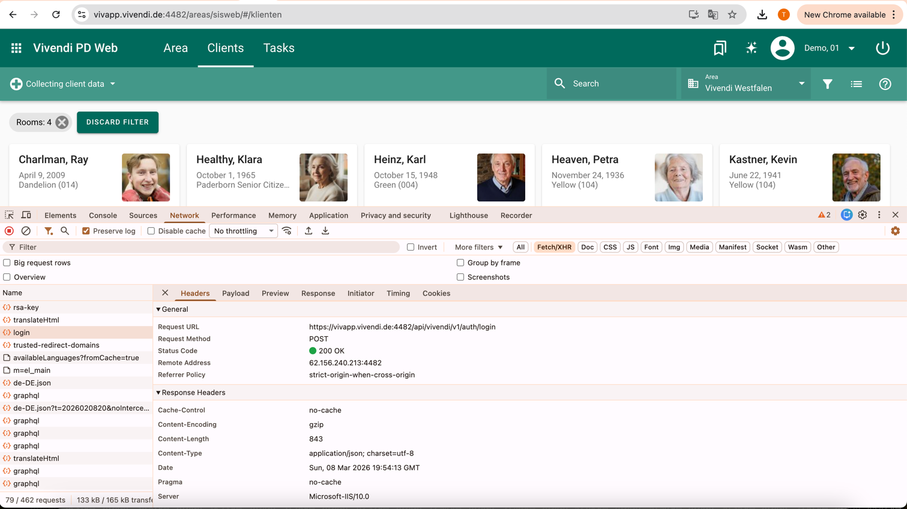
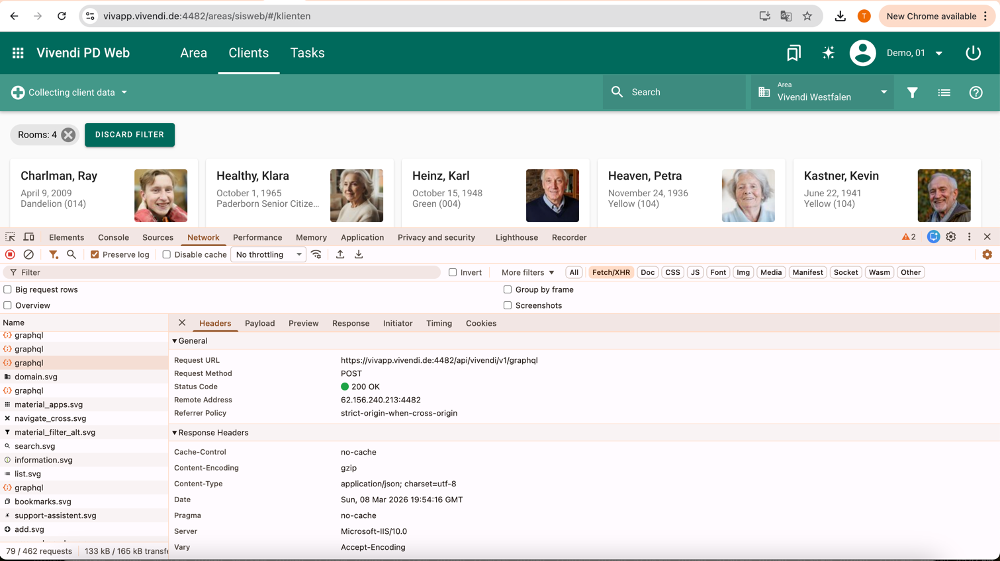

## Introduction

This project implements a minimal Kotlin client for interacting with the Vivendi demo system API. The goal of the project is to reverse-engineer the authentication flow and the resident retrieval request used by the Vivendi web application and reproduce these interactions programmatically using Kotlin and Ktor.

The client performs two primary operations:

Authentication against the Vivendi API using RSA-encrypted credentials

Fetching residents through the Vivendi GraphQL endpoint

The implementation focuses on a clean and testable structure, separating responsibilities into authentication, client communication, and service layers. Only a small subset of the resident data model is implemented, as required by the task.

Tests are included for the critical parts of the system, including authentication, GraphQL query generation, encryption, and resident retrieval.

### Note on Scope

Only a minimal subset of the resident model is implemented, as required by the assignment.

## How to verify integration?

Integration can be verified by running Tests

The project uses Kotlin + Gradle. Tests can be executed using:

./gradlew test

Most tests use Ktor MockEngine, so they run without requiring access to the Vivendi server.

One integration-style test **(VivendiFlowIntegrationTest)** can optionally run against the Vivendi demo system.

## Architecture Decisions

### Project Naming

The project is intentionally named vivendi-client rather than something more generic like care-integration-service.

At the moment, the scope of the implementation is strictly limited to integrating with the Vivendi API. Using a broader name would suggest responsibilities that the project does not currently have and could make the architecture misleading.

By naming it vivendi-client, the project clearly communicates its current responsibility: a client responsible for interacting with the Vivendi system.

If the system later evolves to integrate with multiple care documentation systems or external providers, the project name can be revisited and expanded to better reflect the broader scope.

### Architectural Considerations

The implementation separates external system communication from application-level use cases.

VivendiClient is responsible for the technical integration with the Vivendi API. It handles HTTP communication, authentication requests, cookie extraction, GraphQL requests, and response parsing.

AuthService and ResidentService represent application use cases. They orchestrate the interaction with the client and expose operations that are meaningful from the application's perspective.

This separation keeps the integration logic reusable and isolated, while the services remain simple to test by mocking the client.

#### Why Hexagonal Architecture Was Not Used

I considered implementing a hexagonal (ports and adapters) architecture, but for the scope of this task it would introduce unnecessary complexity.

In the smallest possible hexagonal version of this solution, the structure would look roughly like this:

`domain/
    resident/
        Resident.kt
application/
    auth/
        AuthenticateUseCase.kt
    resident/
        GetResidentsUseCase.kt
    port/
        output/
            AuthPort.kt
            ResidentPort.kt
adapters/
    output/
        vivendi/
        VivendiClientAdapter.kt
        dto/
config/
    DependencyInjection.kt

Application.kt
`
This structure is useful when:

* multiple external systems are supported
* integrations are frequently swapped or replaced
* domain logic must remain completely independent from infrastructure
* none of these conditions apply to this task. The system integrates with exactly one external provider, and there is no domain logic that requires isolation from infrastructure concerns.
* Introducing ports, adapters, and additional abstraction layers would therefore increase the number of files and concepts without improving clarity or flexibility. For a small integration client like this, the current structure keeps the code direct, readable, and easy to test while still maintaining a clear separation between application logic and external communication.

## Approach taken to Reverse Engineer the Vivendi API

I could not find any public documentation of the Vivendi authentication or GraphQL API. 

To implement the integration, I inspected the requests performed by the web application using Chrome DevTools (Network tab).

I copied the captured requests as cURL commands and used as reference for reproducing the authentication flow and GraphQL queries in Kotlin.

Reference document containing the captured requests, check following screenshots to see how I fetched them:

**docs/Vivendi-reverse-engineered.pdf**

### Residents Fetch Flow:

Network inspection revealed the following authentication flow used by the Vivendi web client:

User **->** Browser **->** GET /auth/rsa-key **->** Client encrypts password **->** POST /auth/login **->** Auth cookies issued **->** GraphQL API calls

#### Steps:

* Client fetches a public RSA key
* Password is encrypted using RSA-OAEP
* Login request is sent with encrypted password
* Server returns authentication cookies
* Cookies are used for subsequent GraphQL requests

### Password Encryption

The login request contains an encrypted Base64 string instead of a plaintext password, indicating that the frontend encrypts credentials before transmission.

To reproduce this behavior, the vivendi client encrypts the password using:

RSA/ECB/OAEPWithSHA-256AndMGF1Padding

This was inspired by the encryption code sent in the task.

### Session Handling

After successful authentication, the API returns authentication information through both the response body and cookies.

The Auth-Token (JWT) is available in the response and also set as a cookie. However, the Xsrf-Token is only provided via the Set-Cookie header.

Because subsequent GraphQL requests require both the authentication cookie and the XSRF header, the client extracts these values from the response cookies and stores them for later use.

These tokens are then attached to all GraphQL requests as:

cookies (Auth-Token, Xsrf-Token)
header (x-xsrf-token)

### GraphQL Query Simplification

The original GraphQL query used by the web client returns a large number of fields.
For this implementation, the query was simplified to only fetch the essential resident fields:
* id
* name
* vorname
* geburtsdatum

### Why Apollo Client Was Not Used

Although the API uses GraphQL, Ktor was used instead of Apollo Client to keep the HTTP interaction explicit.

This makes the following aspects transparent:

* authentication cookies
* custom headers
* encrypted login payload
* exact GraphQL request structure

Apollo would introduce additional abstraction that is unnecessary for this small integration client.

### Error Handling Strategy

The client handles common failure scenarios explicitly and uses custom exceptions to make errors clearer for callers.

Two custom exceptions are defined:
* **AuthenticationException** — thrown when authentication fails (e.g., non-success login response or missing authentication cookies).
* **VivendiClientException** — used for general API and integration errors.

#### Handled scenarios include:

* HTTP errors returned by the Vivendi API
* GraphQL errors in the response
* Missing data in the response
* Invalid response format during JSON parsing

Using custom exceptions makes it easier to tell the difference between login problems and API errors, and prevents low-level HTTP or parsing errors from appearing directly in the higher parts of the application.